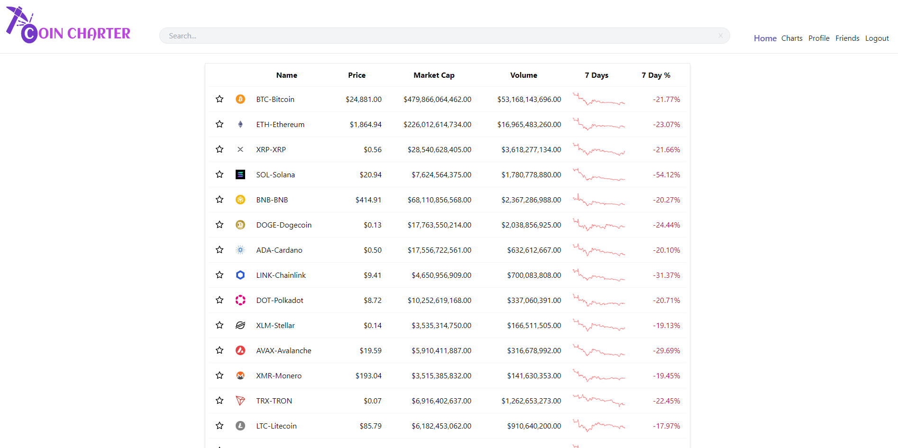

# Coin Charter [](https://opensource.org/licenses/MIT)

This is a full stack web application that allows users to connect and share information about cryptocurrency. [MIT License](https://opensource.org/licenses/MIT)

## Table of Contents

- [Installation](#installation)
- [Usage](#usage)
- [License](#license)
- [Contributing](#contributing)
- [Tests](#tests)
- [Questions](#questions)

## Installation

To install the application and run it with the following code...

```shell
npm install
npm start
```

## Usage

This application can be used to browse and share information about cryptocurrency without having to create an account. Users can create an account to save their favorite coins and add their own charts and comments and share them with other users.

Deployed application: https://coin-charter-au.herokuapp.com/
Github repository: https://github.com/bradbrad88/coin-charter



## License

MIT License (MIT) - [MIT License](https://opensource.org/licenses/MIT)

## Contributing

Sam March
Ben Smerd
Brad Teague

## Tests

There are no tests for this application.

## Questions

[SamMarch](https://github.com/)
[bradbrad88](https://github.com/)
[TheBigBookMan](https://github.com/)

If you have more questions contact us at...
[marchsam1988@gmail.com](marchsam1988@gmail.com)
[b_rad88@live.com](b_rad88@live.com)
[bsmerd@adam.com.au](bsmerd@adam.com.au)
